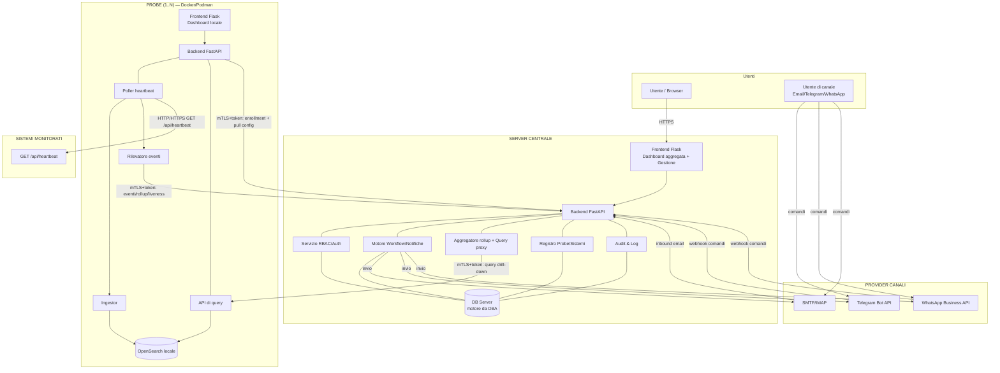
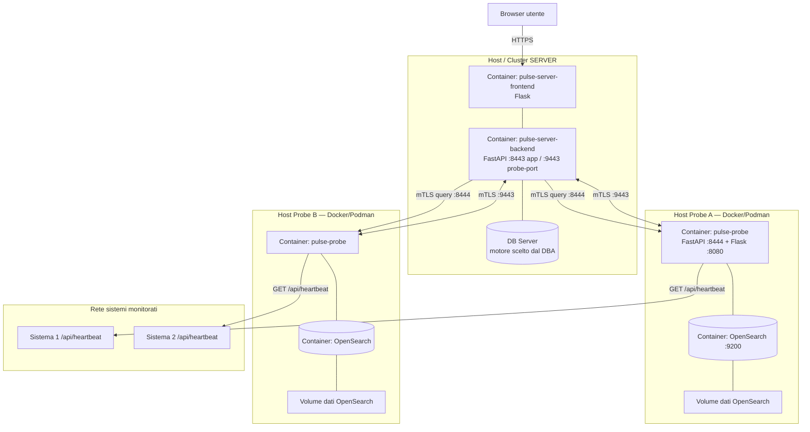
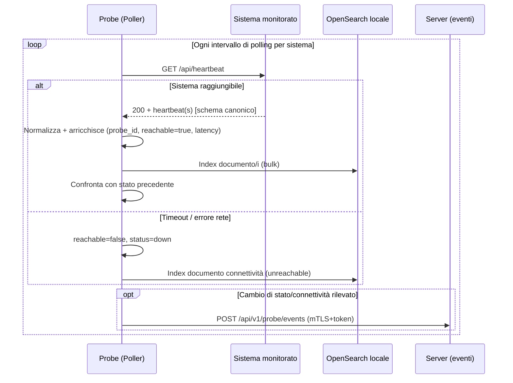
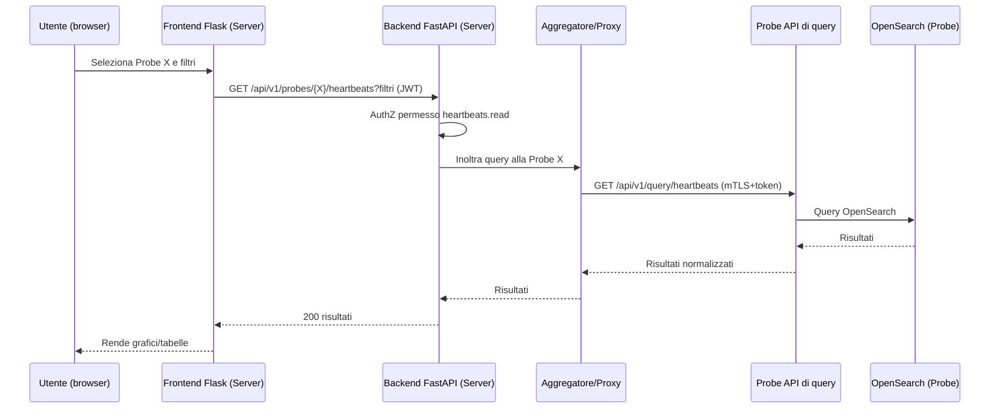
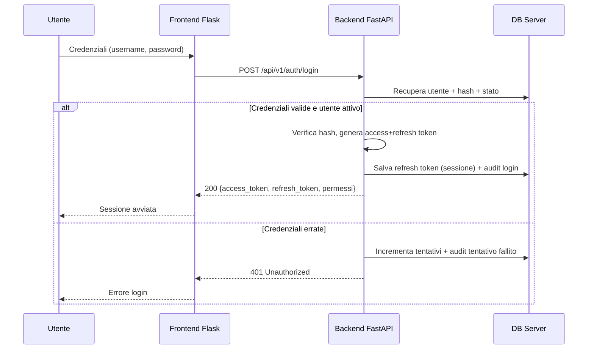
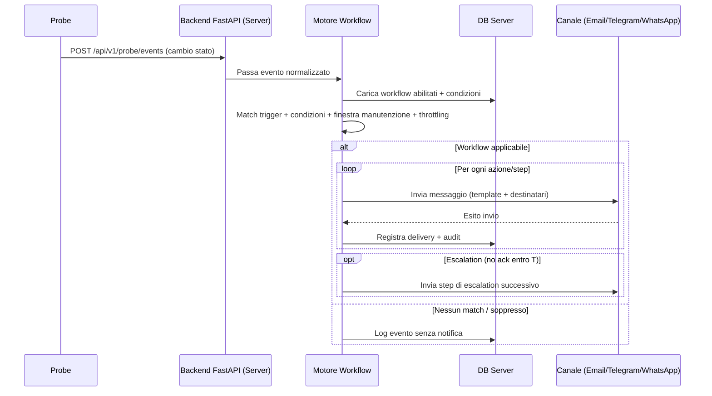
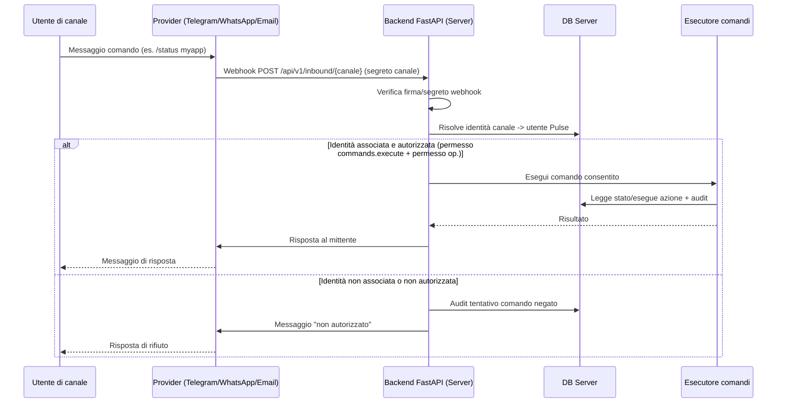
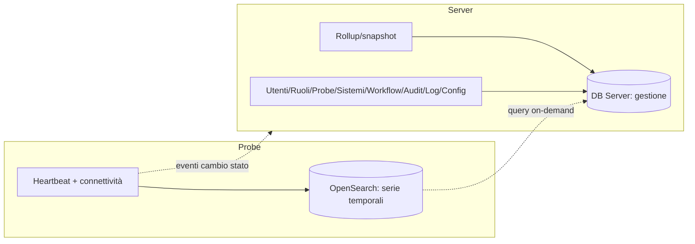

# Pulse — Architettura

Documento: `03_architettura.md`
Autore: AGENTE 1 — ANALISTA
Data: 2026-07-15

Riferimenti: `01_specifica_funzionale.md`, `02_specifica_tecnica.md`, `docs/api/DOCUMENTO_API.md`, `docs/database/DOCUMENTO_DATABASE.md`.

---

## 1. Vista d'insieme

Pulse è un sistema **hub-and-spoke**: un Server centrale e N Probe. Ogni Probe è autonoma nel monitoraggio e nella persistenza locale (OpenSearch); il Server aggrega, gestisce e orchestra notifiche.

Principi architetturali:
- **Autonomia della Probe**: se il Server è irraggiungibile, la Probe continua a monitorare e archiviare localmente.
- **Sorgente unica di gestione**: utenti, ruoli, probe, sistemi, workflow gestiti sul Server.
- **Serie temporali solo su OpenSearch** delle Probe; il Server tiene rollup + query on-demand.
- **Canale cifrato** mTLS + token tra Server e Probe.

---

## 2. Diagramma dei componenti

---

## 3. Diagramma di deployment

---

## 4. Sequence — Probe: polling heartbeat → OpenSearch

---

## 5. Sequence — Server → Probe: query su selezione Probe

---

## 6. Sequence — Login / autenticazione

---

## 7. Sequence — Invio notifica (workflow)

---

## 8. Sequence — Ricezione comando da canale

---

## 9. Flussi dati e confini di persistenza

Confine chiave: **la serie temporale grezza vive solo su OpenSearch delle Probe**; il Server persiste solo dati gestionali + rollup. Dettaglio entità in `docs/database/DOCUMENTO_DATABASE.md`.

---

## 10. QUESTIONI APERTE / DECISIONI

| # | Tema | Decisione | Motivazione |
|---|---|---|---|
| AR-01 | Query drill-down | Server proxy → Probe API query (mTLS) | Mantiene RBAC centralizzato e serie temporali sulle Probe. |
| AR-02 | Dashboard aggregata | Basata su rollup push dalle Probe | Evita fan-out di query a ogni caricamento pagina. |
| AR-03 | Valutazione workflow | Centralizzata sul Server su eventi ricevuti | Config unica, coerenza notifiche, storicizzazione audit. |
| AR-04 | Webhook inbound comandi | Endpoint dedicati per canale con verifica segreto | Fattibilità/sicurezza differenti per canale (vedi `07_workflow_notifiche.md`). |
| AR-05 | Deploy Server | Container o host, TLS via reverse proxy o app | Rimandato al team deploy/BE. |
