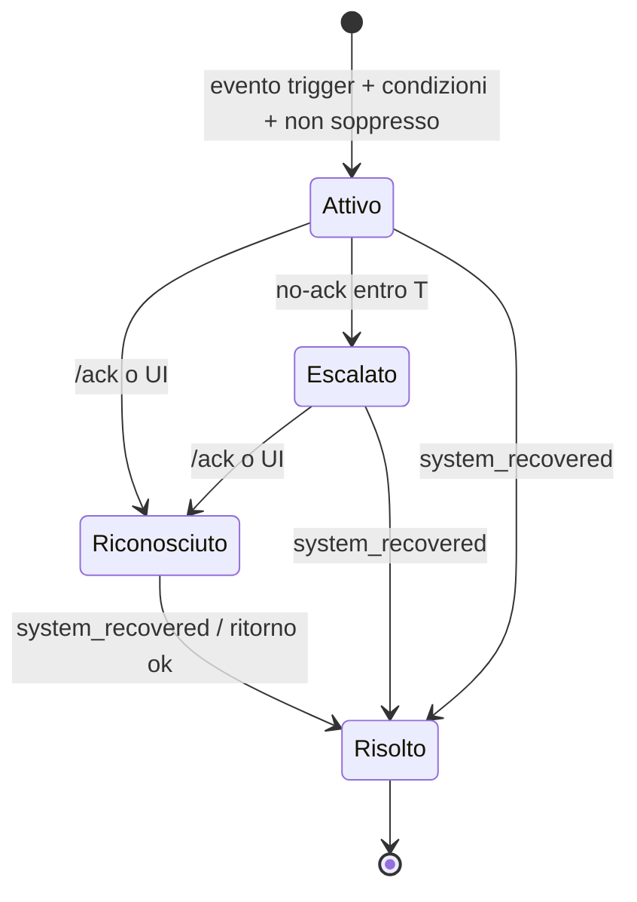

# Pulse — Workflow Notifiche

Documento: `07_workflow_notifiche.md`
Autore: AGENTE 1 — ANALISTA
Data: 2026-07-15

Modello dei **workflow notifiche completamente configurabili** e della **ricezione comandi** per canale. Coerente con entità in `docs/database/DOCUMENTO_DATABASE.md` ed endpoint in `docs/api/DOCUMENTO_API.md`.

---

## 1. Concetti

Un **workflow** collega **eventi** a **azioni** di notifica secondo **condizioni**, con **escalation** e controlli di **soppressione**. Struttura logica:

```
Workflow
 ├─ Trigger (tipo di evento)
 ├─ Ambito (filtri: probe / sistema / check)
 ├─ Condizioni (regole su campi evento, combinabili AND/OR)
 ├─ Controlli di soppressione (throttling, dedup, finestre di manutenzione, orari attivi)
 └─ Step di azione (ordinati)
      ├─ Azione (canale + destinatari + template)
      ├─ Ritardo (delay dallo step precedente)
      └─ Escalation (condizione di avanzamento, es. no-ack entro T)
```

---

## 2. Eventi / Trigger

Gli eventi sono generati dalle Probe (push `POST /api/v1/probe/events`) o dal Server (es. Probe offline). Tipi di trigger configurabili:

| Trigger | Descrizione | Origine |
|---|---|---|
| `status_changed` | Cambio dello `status` normalizzato di un check (es. ok→error). | Probe |
| `status_is` | Lo `status` assume un valore specifico. | Probe |
| `system_unreachable` | Sistema non raggiungibile (connettività). | Probe |
| `system_recovered` | Ritorno a `ok`/raggiungibile dopo uno stato di allarme. | Probe |
| `response_time_exceeded` | `response_ms` supera una soglia. | Probe |
| `sustained_state` | Uno stato persiste per almeno N minuti/M occorrenze. | Probe/Server |
| `probe_offline` | Una Probe non contatta il Server entro il timeout. | Server |
| `probe_online` | Una Probe torna a contattare il Server. | Server |

---

## 3. Ambito (scope)

Filtri che limitano a quali entità si applica il workflow:
- Per **Probe** (una, più, tutte).
- Per **sistema** (`system_id`, lista o tutti).
- Per **check** (`check_id`, lista o tutti).
- Combinabili (es. "sistema myapp, check db, su Probe A").

---

## 4. Condizioni

Regole aggiuntive valutate sull'evento. Ciascuna: `campo` `operatore` `valore`. Combinazione tramite gruppi logici AND/OR.

Campi disponibili: `status`, `previous_status`, `response_ms`, `system_id`, `check_id`, `probe_id`, `reachable`, `message`, e (se `details` parsato) chiavi di `details.metrics.*`.

Operatori: `eq`, `neq`, `gt`, `gte`, `lt`, `lte`, `in`, `not_in`, `contains`, `matches` (regex).

Esempio: `status eq error AND response_ms gt 500`.

---

## 5. Controlli di soppressione

| Controllo | Descrizione |
|---|---|
| **Throttling / cooldown** | Intervallo minimo tra notifiche ripetute per la stessa chiave (probe+system+check+workflow). |
| **Deduplica** | Un evento identico ripetuto entro la finestra non rigenera notifica. |
| **Finestre di manutenzione** | Se il sistema/probe è in manutenzione, gli eventi non generano notifiche. |
| **Orari attivi** | Il workflow agisce solo in determinate fasce orarie/giorni. |
| **Auto-risoluzione** | Alla ricezione di `system_recovered`/ritorno `ok`, chiusura dell'allarme aperto ed eventuale notifica di recupero. |

---

## 6. Step di azione ed escalation

Ogni workflow ha 1..N step ordinati. Ogni step:

| Attributo | Descrizione |
|---|---|
| `step_order` | Ordine di esecuzione. |
| `channel_id` | Canale da usare (Email/Telegram/WhatsApp). |
| `recipients` | Destinatari (indirizzi/chat/numeri o gruppi). |
| `template` | Modello messaggio con segnaposto (`{{system_name}}`, `{{status}}`, `{{response_ms}}`, `{{message}}`, `{{probe}}`, `{{timestamp}}`). |
| `delay_seconds` | Ritardo dallo step precedente. |
| `escalation_condition` | Condizione per procedere allo step successivo (es. `no_ack_within` = T, o `still_active`). |
| `repeat` | Ripetizioni opzionali dello step fino a risoluzione/ack. |

**Escalation**: se lo step corrente non riceve ack (o l'allarme resta attivo) entro `escalation_condition`, si esegue lo step successivo (tipicamente canale/destinatari di livello superiore).

**Acknowledgement (ack)**: un allarme può essere riconosciuto (a) da un comando in ingresso (`/ack`), (b) dalla UI. L'ack ferma le escalation successive.

---

## 7. Ricezione comandi per canale

Requisito: "Ogni canale, ove possibile, deve prevedere anche la RICEZIONE di comandi". Di seguito la **matrice di fattibilità** con motivazione, e i comandi supportati.

### 7.1 Comandi supportati (insieme minimo, previa autorizzazione RBAC dell'utente associato)

| Comando | Effetto | Permesso richiesto |
|---|---|---|
| `/help` | Elenca comandi disponibili all'utente. | `commands.execute` |
| `/status [system_id]` | Stato corrente di un sistema/insieme. | `commands.execute` + `heartbeats.read` |
| `/silence <system_id> <durata>` | Silenzia notifiche (finestra manutenzione temporanea). | `commands.execute` + `workflows.update` |
| `/unsilence <system_id>` | Rimuove il silenziamento. | `commands.execute` + `workflows.update` |
| `/ack <alarm_id>` | Riconosce un allarme (ferma escalation). | `commands.execute` |
| `/probes` | Elenco stato Probe. | `commands.execute` + `probes.read` |

### 7.2 Matrice di fattibilità ricezione comandi per canale

| Canale | Ricezione comandi | Meccanismo | Note / Limiti |
|---|:--:|---|---|
| **Telegram** | **Sì (pieno)** | Bot API + **webhook** verso `POST /api/v1/inbound/telegram` con secret token; identità = `chat_id`/`user_id`. | Canale ideale per comandi: bidirezionale nativo, identità stabile, verifica webhook. |
| **WhatsApp** | **Sì (condizionato)** | WhatsApp Business API (provider) + **webhook** verso `POST /api/v1/inbound/whatsapp` con verifica firma; identità = numero telefono. | Dipende dal provider Business API abilitato; vincoli su finestre di conversazione (24h) e template per messaggi in uscita. Senza Business API la ricezione **non è possibile** (WhatsApp non consente bot arbitrari). |
| **Email** | **Sì (limitato)** | Ingest email in ingresso: (a) webhook da provider inbound-email, oppure (b) polling casella IMAP → `POST /api/v1/inbound/email`. Identità = indirizzo mittente. | Bassa affidabilità/latenza; spoofing del mittente possibile → richiede verifica aggiuntiva (es. token/passphrase nel corpo, DKIM/SPF). Adatto a comandi non critici. |

### 7.3 Cosa NON è possibile / sconsigliato (motivato)

- **Email come canale di comando critico**: il mittente è falsificabile; latenza e recapito non garantiti. Decisione: consentito solo per comandi a basso rischio e con verifica token nel corpo; comandi come `/silence` su email richiedono conferma aggiuntiva o sono disabilitabili in configurazione.
- **WhatsApp senza Business API**: non è tecnicamente possibile ricevere/inviare programmaticamente; in tal caso il canale è **solo teorico** e va segnalato come non operativo.
- **Autenticazione forte via canale**: nessun canale sostituisce il login RBAC; l'esecuzione è sempre vincolata all'associazione identità→utente (UC-80) e ai permessi dell'utente.

### 7.4 Sicurezza ricezione comandi
- Verifica del **segreto/firma** del webhook per ogni canale (respinge richieste non autentiche).
- Risoluzione **identità di canale → utente Pulse**; se non associata, comando rifiutato.
- Verifica **permessi RBAC** dell'utente per l'operazione.
- **Audit** di ogni comando (eseguito o negato).
- **Rate limiting** sugli endpoint inbound.

---

## 8. Ciclo di vita di un allarme



---

## 9. Entità coinvolte (rimando al modello dati)
`notification_channels`, `notification_workflows`, `workflow_conditions`, `workflow_actions` (step), `notification_deliveries` (storico invii), `alarms` (allarmi/stato ack), `channel_identities` (identità canale↔utente), `inbound_commands` (log comandi). Dettaglio in `docs/database/DOCUMENTO_DATABASE.md`.

---

## 10. QUESTIONI APERTE / DECISIONI

| # | Tema | Decisione | Motivazione | Da confermare a |
|---|---|---|---|---|
| WF-01 | Ricezione comandi WhatsApp | Supportata solo con WhatsApp Business API di un provider | Vincolo tecnico della piattaforma; senza provider non è possibile. | Committente |
| WF-02 | Ricezione comandi Email | Supportata ma limitata a comandi non critici + verifica token/DKIM | Rischio spoofing e recapito non garantito. | Committente |
| WF-03 | Inbound email: webhook vs IMAP polling | Entrambi previsti, scelta in configurazione | Dipende dall'infrastruttura mail disponibile. | Committente / BE |
| WF-04 | Set comandi | Insieme minimo §7.1 | Copre gli usi operativi essenziali senza ampliare l'ambito. | Committente |
| WF-05 | Gestione allarmi/ack persistenti | Introdotta entità `alarms` sul DB Server | Necessaria per escalation e auto-risoluzione; non è serie temporale. | DBA |
| WF-06 | Provider WhatsApp specifico | Non deciso | Dipende dal contratto/provider del committente. | Committente |
