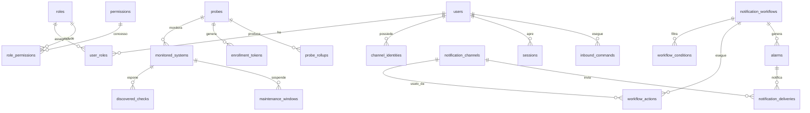

# Pulse — Documento Database (Modello Logico)

Documento: `docs/database/DOCUMENTO_DATABASE.md`
Autore: AGENTE 1 — ANALISTA
Data: 2026-07-15
Destinatario: DBA

Questo documento fornisce il **modello logico agnostico dal motore**. La scelta del motore del DB Server è **compito del DBA** (vedi §6 Requisiti dati per la scelta). Le serie temporali degli heartbeat risiedono su **OpenSearch locale a ciascuna Probe** (§5).

Coerenza garantita con: permessi (`docs/analisi/06_rbac.md`), API (`docs/api/DOCUMENTO_API.md`), casi d'uso e requisiti.

---

## 1. Ripartizione della persistenza

| Dato | Dove risiede |
|---|---|
| Utenti, ruoli, permessi, relazioni RBAC | **DB Server** |
| Probe (definizioni, credenziali, stato) | **DB Server** |
| Sistemi monitorati, assegnazioni, soglie, finestre manutenzione | **DB Server** |
| Check scoperti (registro sintetico) | **DB Server** (registro) + derivati da OpenSearch |
| Canali notifica, workflow, azioni, condizioni | **DB Server** |
| Allarmi, identità canale, comandi in ingresso (log) | **DB Server** |
| Storico invii notifiche (delivery) | **DB Server** |
| Audit log | **DB Server** (append-only) |
| Log di sistema | **DB Server** (aggregati) + locale Probe |
| Configurazione | **DB Server** |
| Sessioni / refresh token / token enrollment | **DB Server** |
| Rollup/snapshot per dashboard aggregata | **DB Server** |
| **Heartbeat / serie temporali / eventi connettività** | **OpenSearch (Probe)** |

Principio: la serie temporale grezza NON è duplicata sul DB Server (RF-051).

---

## 2. Tipi logici usati

`UUID`, `STRING(n)`, `TEXT`, `INT`, `BIGINT`, `DECIMAL`, `BOOLEAN`, `TIMESTAMP` (UTC), `ENUM(...)`, `JSON` (documento strutturato), `ARRAY<T>`. Sono tipi **logici**; il DBA li mappa sui tipi nativi del motore scelto.

Convenzioni: ogni entità ha `id UUID PK`; `created_at`/`updated_at TIMESTAMP` ove utile; nomi entità al plurale.

---

## 3. Entità del DB Server

### 3.1 users (utenti)
| Attributo | Tipo | Vincoli | Note |
|---|---|---|---|
| id | UUID | PK | |
| username | STRING(100) | UNIQUE, NOT NULL | |
| email | STRING(255) | UNIQUE, NOT NULL | |
| full_name | STRING(255) | | |
| password_hash | STRING(255) | NOT NULL | hash forte+salt |
| status | ENUM(active,disabled,locked) | NOT NULL, default active | |
| failed_login_count | INT | default 0 | policy blocco |
| last_login_at | TIMESTAMP | NULL | |
| created_at | TIMESTAMP | NOT NULL | |
| updated_at | TIMESTAMP | NOT NULL | |

### 3.2 roles (ruoli)
| Attributo | Tipo | Vincoli | Note |
|---|---|---|---|
| id | UUID | PK | |
| name | STRING(100) | UNIQUE, NOT NULL | |
| description | STRING(255) | | |
| is_builtin | BOOLEAN | NOT NULL, default false | ruoli predefiniti non eliminabili |
| created_at | TIMESTAMP | NOT NULL | |
| updated_at | TIMESTAMP | NOT NULL | |

### 3.3 permissions (permessi) — catalogo fisso
| Attributo | Tipo | Vincoli | Note |
|---|---|---|---|
| code | STRING(64) | PK | es. `users.read` |
| area | STRING(40) | NOT NULL | es. `users` |
| description | STRING(255) | NOT NULL | |

> Popolato da seed dal catalogo in `06_rbac.md` (40 permessi). Non creabile via API.

### 3.4 user_roles (utenti↔ruoli) — associativa
| Attributo | Tipo | Vincoli |
|---|---|---|
| user_id | UUID | FK→users.id, PK(comp.) |
| role_id | UUID | FK→roles.id, PK(comp.) |
| assigned_at | TIMESTAMP | |

Cardinalità: N utenti ↔ N ruoli.

### 3.5 role_permissions (ruoli↔permessi) — associativa
| Attributo | Tipo | Vincoli |
|---|---|---|
| role_id | UUID | FK→roles.id, PK(comp.) |
| permission_code | STRING(64) | FK→permissions.code, PK(comp.) |

Cardinalità: N ruoli ↔ N permessi.

### 3.6 probes (sonde)
| Attributo | Tipo | Vincoli | Note |
|---|---|---|---|
| id | UUID | PK | `probe_id` |
| name | STRING(100) | UNIQUE, NOT NULL | |
| description | STRING(255) | | |
| query_endpoint | STRING(255) | | URL API query Probe (per drill-down) |
| tags | ARRAY<STRING> / JSON | | |
| enabled | BOOLEAN | NOT NULL, default true | |
| status | ENUM(pending,online,offline) | default pending | derivato da liveness |
| token_hash | STRING(255) | NULL | hash del probe_token corrente |
| certificate_fingerprint | STRING(255) | NULL | mTLS |
| version | STRING(40) | NULL | |
| last_seen_at | TIMESTAMP | NULL | |
| last_sync_at | TIMESTAMP | NULL | |
| last_error | TEXT | NULL | |
| config_version | STRING(40) | | incrementato a ogni modifica config assegnata |
| created_at / updated_at | TIMESTAMP | | |

### 3.7 enrollment_tokens (token di enrollment)
| Attributo | Tipo | Vincoli | Note |
|---|---|---|---|
| id | UUID | PK | |
| probe_id | UUID | FK→probes.id, NOT NULL | |
| token_hash | STRING(255) | NOT NULL | monouso |
| expires_at | TIMESTAMP | NOT NULL | |
| used_at | TIMESTAMP | NULL | |
| created_at | TIMESTAMP | | |

### 3.8 monitored_systems (sistemi monitorati)
| Attributo | Tipo | Vincoli | Note |
|---|---|---|---|
| id | UUID | PK | |
| system_id | STRING(100) | UNIQUE, NOT NULL | corrisponde a `system_id` heartbeat |
| system_name | STRING(255) | NOT NULL | |
| heartbeat_url | STRING(500) | NOT NULL | endpoint `GET /api/heartbeat` |
| probe_id | UUID | FK→probes.id, NOT NULL | 1 sistema → 1 probe |
| poll_interval_seconds | INT | NOT NULL | |
| timeout_seconds | INT | NOT NULL | |
| enabled | BOOLEAN | NOT NULL, default true | |
| response_ms_warn | INT | NULL | soglia |
| response_ms_error | INT | NULL | soglia |
| created_at / updated_at | TIMESTAMP | | |

Cardinalità: 1 probe → N sistemi; 1 sistema → 1 probe.

### 3.9 maintenance_windows (finestre di manutenzione)
| Attributo | Tipo | Vincoli | Note |
|---|---|---|---|
| id | UUID | PK | |
| system_id | UUID | FK→monitored_systems.id, NULL | NULL = globale/per-probe |
| probe_id | UUID | FK→probes.id, NULL | ambito alternativo |
| start_at | TIMESTAMP | NOT NULL | |
| end_at | TIMESTAMP | NOT NULL | |
| note | STRING(255) | | |
| created_by | UUID | FK→users.id | |
| created_at | TIMESTAMP | | |

### 3.10 discovered_checks (check scoperti — registro)
| Attributo | Tipo | Vincoli | Note |
|---|---|---|---|
| id | UUID | PK | |
| system_id | UUID | FK→monitored_systems.id | |
| check_id | STRING(100) | NOT NULL | da heartbeat |
| check_name | STRING(255) | | da heartbeat |
| probe_id | UUID | FK→probes.id | |
| last_status | STRING(40) | | ultimo stato noto |
| last_seen_at | TIMESTAMP | | |
| UNIQUE(system_id, check_id) | | | |

> Registro sintetico per navigazione/UI; i dati puntuali sono su OpenSearch.

### 3.11 notification_channels (canali notifica)
| Attributo | Tipo | Vincoli | Note |
|---|---|---|---|
| id | UUID | PK | |
| name | STRING(100) | UNIQUE, NOT NULL | |
| type | ENUM(email,telegram,whatsapp) | NOT NULL | |
| enabled | BOOLEAN | default true | |
| inbound_enabled | BOOLEAN | default false | ricezione comandi |
| config | JSON | NOT NULL | parametri (segreti cifrati) |
| created_at / updated_at | TIMESTAMP | | |

> I segreti dentro `config` devono essere cifrati a riposo (RNF-004).

### 3.12 notification_workflows (workflow)
| Attributo | Tipo | Vincoli | Note |
|---|---|---|---|
| id | UUID | PK | |
| name | STRING(100) | UNIQUE, NOT NULL | |
| description | STRING(255) | | |
| enabled | BOOLEAN | default true | |
| trigger | ENUM(status_changed,status_is,system_unreachable,system_recovered,response_time_exceeded,sustained_state,probe_offline,probe_online) | NOT NULL | |
| scope | JSON | | probe_ids, system_ids, check_ids |
| suppression | JSON | | cooldown, dedup, active_hours, respect_maintenance |
| created_by | UUID | FK→users.id | |
| created_at / updated_at | TIMESTAMP | | |

### 3.13 workflow_conditions (condizioni)
| Attributo | Tipo | Vincoli | Note |
|---|---|---|---|
| id | UUID | PK | |
| workflow_id | UUID | FK→notification_workflows.id, NOT NULL | |
| field | STRING(100) | NOT NULL | es. status, response_ms |
| op | ENUM(eq,neq,gt,gte,lt,lte,in,not_in,contains,matches) | NOT NULL | |
| value | JSON | | valore/lista |
| logic_group | STRING(20) | | raggruppamento AND/OR |
| order_index | INT | | |

Cardinalità: 1 workflow → N condizioni.

### 3.14 workflow_actions (step/azioni)
| Attributo | Tipo | Vincoli | Note |
|---|---|---|---|
| id | UUID | PK | |
| workflow_id | UUID | FK→notification_workflows.id, NOT NULL | |
| step_order | INT | NOT NULL | ordine escalation |
| channel_id | UUID | FK→notification_channels.id, NOT NULL | |
| recipients | JSON | NOT NULL | destinatari/gruppi |
| template | TEXT | NOT NULL | messaggio con segnaposto |
| delay_seconds | INT | default 0 | |
| escalation_condition | JSON | | es. no_ack_within |
| repeat | JSON | NULL | ripetizioni |
| UNIQUE(workflow_id, step_order) | | | |

Cardinalità: 1 workflow → N azioni.

### 3.15 alarms (allarmi)
| Attributo | Tipo | Vincoli | Note |
|---|---|---|---|
| id | UUID | PK | |
| workflow_id | UUID | FK→notification_workflows.id | |
| probe_id | UUID | FK→probes.id | |
| system_id | UUID | FK→monitored_systems.id | |
| check_id | STRING(100) | NULL | |
| dedup_key | STRING(255) | | probe+system+check+workflow |
| status | ENUM(active,acknowledged,resolved) | NOT NULL | |
| current_step | INT | | step escalation corrente |
| opened_at | TIMESTAMP | NOT NULL | |
| acknowledged_at | TIMESTAMP | NULL | |
| acknowledged_by | UUID | FK→users.id, NULL | |
| resolved_at | TIMESTAMP | NULL | |
| INDEX(dedup_key, status) | | | throttling/dedup |

### 3.16 notification_deliveries (storico invii)
| Attributo | Tipo | Vincoli | Note |
|---|---|---|---|
| id | UUID | PK | |
| workflow_id | UUID | FK→notification_workflows.id, NULL | NULL per test |
| action_id | UUID | FK→workflow_actions.id, NULL | |
| alarm_id | UUID | FK→alarms.id, NULL | |
| channel_id | UUID | FK→notification_channels.id, NOT NULL | |
| recipient | STRING(255) | NOT NULL | |
| status | ENUM(sent,failed,retrying) | NOT NULL | |
| error | TEXT | NULL | |
| retry_count | INT | default 0 | |
| created_at | TIMESTAMP | NOT NULL | |

### 3.17 channel_identities (identità canale↔utente)
| Attributo | Tipo | Vincoli | Note |
|---|---|---|---|
| id | UUID | PK | |
| user_id | UUID | FK→users.id, NOT NULL | |
| channel_type | ENUM(email,telegram,whatsapp) | NOT NULL | |
| external_id | STRING(255) | NOT NULL | chat_id / numero / email |
| verified | BOOLEAN | default false | |
| verification_code | STRING(64) | NULL | temporaneo |
| created_at | TIMESTAMP | | |
| UNIQUE(channel_type, external_id) | | | una identità → un utente |

### 3.18 inbound_commands (log comandi ricevuti)
| Attributo | Tipo | Vincoli | Note |
|---|---|---|---|
| id | UUID | PK | |
| channel_type | ENUM(email,telegram,whatsapp) | NOT NULL | |
| external_id | STRING(255) | NOT NULL | mittente |
| user_id | UUID | FK→users.id, NULL | risolto se associato |
| command | STRING(100) | NOT NULL | es. /status |
| args | JSON | | |
| outcome | ENUM(executed,denied,error) | NOT NULL | |
| response | TEXT | | |
| received_at | TIMESTAMP | NOT NULL | |

### 3.19 audit_log (audit — append-only)
| Attributo | Tipo | Vincoli | Note |
|---|---|---|---|
| id | UUID | PK | |
| timestamp | TIMESTAMP | NOT NULL | |
| actor_type | ENUM(user,probe,system) | NOT NULL | |
| actor_id | STRING(100) | NULL | |
| action | STRING(100) | NOT NULL | es. user.create |
| entity_type | STRING(100) | | |
| entity_id | STRING(100) | NULL | |
| outcome | ENUM(success,failure) | NOT NULL | |
| ip | STRING(64) | NULL | |
| details | JSON | | before/after mascherati |

> Immutabile: nessun UPDATE/DELETE via API applicative (RNF-006). Il DBA valuta meccanismi di sola-append.

### 3.20 system_logs (log di sistema)
| Attributo | Tipo | Vincoli | Note |
|---|---|---|---|
| id | UUID | PK | |
| timestamp | TIMESTAMP | NOT NULL | |
| component | ENUM(server,probe) | NOT NULL | |
| probe_id | UUID | FK→probes.id, NULL | |
| level | ENUM(debug,info,warning,error,critical) | NOT NULL | |
| logger | STRING(255) | | |
| message | TEXT | NOT NULL | |
| context | JSON | | |
| INDEX(timestamp, component, level) | | | |

### 3.21 configuration (configurazione)
| Attributo | Tipo | Vincoli | Note |
|---|---|---|---|
| key | STRING(100) | PK | es. probe_port |
| value | JSON | | tipizzato |
| type | STRING(40) | | int/string/bool/... |
| sensitive | BOOLEAN | default false | mascheramento |
| requires_restart | BOOLEAN | default false | |
| description | STRING(255) | | |
| updated_by | UUID | FK→users.id, NULL | |
| updated_at | TIMESTAMP | | |

### 3.22 sessions / refresh_tokens (sessioni)
| Attributo | Tipo | Vincoli | Note |
|---|---|---|---|
| id | UUID | PK | |
| user_id | UUID | FK→users.id, NOT NULL | |
| refresh_token_hash | STRING(255) | NOT NULL | |
| issued_at | TIMESTAMP | NOT NULL | |
| expires_at | TIMESTAMP | NOT NULL | |
| revoked_at | TIMESTAMP | NULL | logout/revoca |
| user_agent | STRING(255) | NULL | |
| ip | STRING(64) | NULL | |

### 3.23 probe_rollups (snapshot per dashboard aggregata)
| Attributo | Tipo | Vincoli | Note |
|---|---|---|---|
| id | UUID | PK | |
| probe_id | UUID | FK→probes.id, NOT NULL | |
| window | STRING(20) | | es. 1h/24h |
| payload | JSON | NOT NULL | riepilogo sistemi/check/uptime |
| generated_at | TIMESTAMP | NOT NULL | |
| INDEX(probe_id, generated_at) | | | ultimo rollup per probe |

> Non è serie temporale grezza: è un riepilogo periodico. Retention breve.

---

## 4. Diagramma ER (logico, DB Server)

---

## 5. OpenSearch (Probe) — serie temporali

### 5.1 Indice heartbeat
Nome logico: `pulse-heartbeats-*` (rollover per data, ISM). Un documento per (sistema, check, timestamp).

| Campo | Tipo OpenSearch | Origine | Note |
|---|---|---|---|
| @timestamp | date | sistema | istante check |
| system_id | keyword | heartbeat | |
| system_name | keyword/text | heartbeat | |
| check_id | keyword | heartbeat | |
| check_name | keyword/text | heartbeat | |
| status | keyword | heartbeat | valore grezzo |
| status_normalized | keyword | Probe | {ok,warn,error,down,unknown} |
| response_ms | integer | heartbeat | |
| message | text | heartbeat | può essere null |
| details | text/keyword | heartbeat | stringa JSON grezza |
| details_parsed | object | Probe | parsing di `details` se JSON valido (per query su metrics) |
| probe_id | keyword | Probe | |
| reachable | boolean | Probe | esito connettività |
| http_status | integer | Probe | codice HTTP della chiamata /api/heartbeat |
| latency_ms | integer | Probe | latenza di rete misurata dalla Probe |
| ingested_at | date | Probe | istante indicizzazione |

### 5.2 Indice eventi connettività (opzionale/derivato)
Nome logico: `pulse-events-*`. Registra cambi di stato/raggiungibilità utili a timeline e ricostruzione. Campi: `@timestamp, type, system_id, check_id, status, previous_status, reachable, probe_id`.

### 5.3 Politiche
- ISM per rollover + retention configurabile (RNF-052).
- Nessun dato gestionale su OpenSearch.

---

## 6. Requisiti dati per la scelta del motore (per il DBA)

Il DBA sceglie e motiva il motore. Elementi rilevanti:

1. **Relazionalità forte**: molte relazioni N:N (RBAC), FK e integrità referenziale → adatto un RDBMS relazionale.
2. **Transazionalità (ACID)**: operazioni multi-tabella (es. creazione utente+ruoli, workflow+condizioni+azioni) richiedono transazioni.
3. **Immutabilità audit**: `audit_log` append-only → valutare permessi/trigger o partizionamento; nessun UPDATE/DELETE applicativo.
4. **Campi JSON**: `config`, `scope`, `suppression`, `recipients`, `details` → serve supporto a colonne JSON/documento con query.
5. **Volumi**: entità gestionali di volume medio-basso; `audit_log`, `system_logs`, `notification_deliveries`, `inbound_commands` crescono nel tempo → serve indicizzazione temporale ed eventuale partizionamento/retention. (Le serie temporali grandi stanno su OpenSearch, non qui.)
6. **Unicità e vincoli**: molti UNIQUE (username, email, system_id, name) → enforcement lato DB.
7. **Cifratura a riposo**: segreti in `config`/canali → cifratura applicativa o del motore.
8. **Concorrenza**: accessi concorrenti moderati (UI + ingest eventi/rollup dalle Probe).
9. **Portabilità/deploy**: coerenza con deploy containerizzato; nessun vincolo proprietario imposto dai requisiti.
10. **Backup/restore**: necessari per dati gestionali e audit.

Nota: la scelta tra RDBMS puro o RDBMS con supporto JSON è a discrezione del DBA sulla base di quanto sopra. I requisiti indicano una forte componente relazionale + alcune strutture JSON.

---

## 7. Tracciabilità entità → requisiti/permessi

| Entità | Requisiti | Permessi correlati |
|---|---|---|
| users, user_roles | RF-020, RF-021 | users.* |
| roles, role_permissions, permissions | RF-010..014, RF-022, RF-023 | roles.*, permissions.read |
| probes, enrollment_tokens | RF-030..033, RF-111 | probes.* |
| monitored_systems, maintenance_windows | RF-034, RF-040..043 | systems.* |
| discovered_checks | RF-044 | checks.read |
| (OpenSearch) heartbeats/events | RF-041, RF-042, RF-050..052, RF-063 | heartbeats.read, heartbeats.query |
| probe_rollups | RF-060, RF-061 | dashboard.read |
| notification_channels | RF-070..073 | notifications.* |
| notification_workflows, workflow_conditions, workflow_actions | RF-080..083 | workflows.* |
| alarms | RF-083 | workflows.read, commands.execute |
| notification_deliveries | RF-072 | notifications.read |
| channel_identities, inbound_commands | RF-090..092 | commands.execute |
| audit_log | RF-100, RF-101 | audit.read |
| system_logs | RF-102, RF-103 | syslog.read |
| configuration | RF-110, RF-112 | config.read/update |
| sessions | RF-002, RF-003 | — |

---

## 8. QUESTIONI APERTE / DECISIONI (Database)

| # | Tema | Decisione | Motivazione | Da confermare a |
|---|---|---|---|---|
| DB-01 | Motore DB Server | NON deciso (compito DBA) | Requisito esplicito. Fornito il modello logico + requisiti dati. | DBA |
| DB-02 | `details_parsed` su OpenSearch | Indicizzato solo se `details` è JSON valido | Abilita query su metrics senza rompere lo schema (che definisce `details` stringa). | BE/DBA |
| DB-03 | Registro `discovered_checks` sul Server | Incluso come registro sintetico | Serve a UI/navigazione senza query costanti a OpenSearch; i dati puntuali restano su OpenSearch. | DBA |
| DB-04 | Log Probe su DB Server vs solo locale | Ibrido: aggregati sul Server + locali sulla Probe | Le Probe possono essere offline; garantisce consultazione centralizzata e locale. | BE |
| DB-05 | Immutabilità audit | Append-only a livello applicativo; enforcement DB a scelta DBA | Requisito RNF-006. | DBA |
| DB-06 | Retention `system_logs`/`notification_deliveries`/`inbound_commands` | Configurabile, default da definire | Crescita nel tempo; evitare gonfiare il DB Server. | DBA |
| DB-07 | Rollup vs query live | Tabella `probe_rollups` con retention breve | Supporta dashboard aggregata senza fan-out (AR-02). | BE/DBA |
