# Pulse — Diagramma ER (DB Server, PostgreSQL 16)

Documento: `docs/database/ER_DIAGRAM.md`
Autore: AGENTE 2 — DBA
Data: 2026-07-15

Diagramma Entita'-Relazione fisico del **DB Server**, coerente al 100% con il
modello logico (`DOCUMENTO_DATABASE.md` §3) e con i nomi/campi del
`DOCUMENTO_API.md`. Le 23 entita' del modello logico (§3.1–§3.23) sono tutte
rappresentate. Le serie temporali (heartbeat/eventi) risiedono su **OpenSearch**
locale alle Probe e **non** fanno parte di questo schema (RF-051).

Legenda tipi: `uuid`, `varchar`, `text`, `int`, `bool`, `timestamptz`, `jsonb`.
Marcatori: `PK` chiave primaria, `FK` chiave esterna, `UK` vincolo di unicita'.

```mermaid
erDiagram
    users ||--o{ user_roles : "ha"
    roles ||--o{ user_roles : "assegnato a"
    roles ||--o{ role_permissions : "include"
    permissions ||--o{ role_permissions : "concesso in"
    users ||--o{ sessions : "apre"
    users ||--o{ channel_identities : "possiede"
    users ||--o{ inbound_commands : "esegue"

    probes ||--o{ enrollment_tokens : "genera"
    probes ||--o{ monitored_systems : "monitora"
    probes ||--o{ probe_rollups : "produce"
    probes ||--o{ discovered_checks : "rileva"
    probes ||--o{ maintenance_windows : "ambito"
    probes ||--o{ system_logs : "origina"

    monitored_systems ||--o{ discovered_checks : "espone"
    monitored_systems ||--o{ maintenance_windows : "sospende"

    notification_workflows ||--o{ workflow_conditions : "filtra"
    notification_workflows ||--o{ workflow_actions : "esegue"
    notification_channels ||--o{ workflow_actions : "usato da"
    notification_workflows ||--o{ alarms : "genera"
    notification_channels ||--o{ notification_deliveries : "invia"
    workflow_actions ||--o{ notification_deliveries : "produce"
    alarms ||--o{ notification_deliveries : "notifica"

    monitored_systems ||--o{ alarms : "riguarda"
    probes ||--o{ alarms : "riguarda"
    users ||--o{ alarms : "riconosce"

    users ||--o{ maintenance_windows : "crea"
    users ||--o{ notification_workflows : "crea"
    users ||--o{ configuration : "aggiorna"

    users {
        uuid id PK
        varchar username UK
        varchar email UK
        varchar full_name
        varchar password_hash
        varchar status
        int failed_login_count
        timestamptz last_login_at
        timestamptz created_at
        timestamptz updated_at
    }

    roles {
        uuid id PK
        varchar name UK
        varchar description
        bool is_builtin
        timestamptz created_at
        timestamptz updated_at
    }

    permissions {
        varchar code PK
        varchar area
        varchar description
    }

    user_roles {
        uuid user_id PK,FK
        uuid role_id PK,FK
        timestamptz assigned_at
    }

    role_permissions {
        uuid role_id PK,FK
        varchar permission_code PK,FK
    }

    probes {
        uuid id PK
        varchar name UK
        varchar description
        varchar query_endpoint
        jsonb tags
        bool enabled
        varchar status
        varchar token_hash
        varchar certificate_fingerprint
        varchar version
        timestamptz last_seen_at
        timestamptz last_sync_at
        text last_error
        varchar config_version
        varchar location
        varchar contact_name
        varchar contact_email
        varchar contact_phone
        timestamptz created_at
        timestamptz updated_at
    }

    enrollment_tokens {
        uuid id PK
        uuid probe_id FK
        varchar token_hash
        timestamptz expires_at
        timestamptz used_at
        timestamptz created_at
    }

    monitored_systems {
        uuid id PK
        varchar system_id UK
        varchar system_name
        varchar kind
        varchar heartbeat_url
        varchar tcp_host
        int tcp_port
        uuid probe_id FK
        int poll_interval_seconds
        int timeout_seconds
        bool enabled
        int response_ms_warn
        int response_ms_error
        timestamptz created_at
        timestamptz updated_at
    }

    maintenance_windows {
        uuid id PK
        uuid system_id FK
        uuid probe_id FK
        timestamptz start_at
        timestamptz end_at
        varchar note
        uuid created_by FK
        timestamptz created_at
    }

    discovered_checks {
        uuid id PK
        uuid system_id FK
        varchar check_id
        varchar check_name
        uuid probe_id FK
        varchar last_status
        timestamptz last_seen_at
    }

    notification_channels {
        uuid id PK
        varchar name UK
        varchar type
        bool enabled
        bool inbound_enabled
        jsonb config
        timestamptz created_at
        timestamptz updated_at
    }

    notification_workflows {
        uuid id PK
        varchar name UK
        varchar description
        bool enabled
        varchar trigger
        jsonb scope
        jsonb suppression
        uuid created_by FK
        timestamptz created_at
        timestamptz updated_at
    }

    workflow_conditions {
        uuid id PK
        uuid workflow_id FK
        varchar field
        varchar op
        jsonb value
        varchar logic_group
        int order_index
    }

    workflow_actions {
        uuid id PK
        uuid workflow_id FK
        int step_order
        uuid channel_id FK
        jsonb recipients
        text template
        int delay_seconds
        jsonb escalation_condition
        jsonb repeat
    }

    alarms {
        uuid id PK
        uuid workflow_id FK
        uuid probe_id FK
        uuid system_id FK
        varchar check_id
        varchar dedup_key
        varchar status
        int current_step
        timestamptz opened_at
        timestamptz acknowledged_at
        uuid acknowledged_by FK
        timestamptz resolved_at
    }

    notification_deliveries {
        uuid id PK
        uuid workflow_id FK
        uuid action_id FK
        uuid alarm_id FK
        uuid channel_id FK
        varchar recipient
        varchar status
        text error
        int retry_count
        timestamptz created_at
    }

    channel_identities {
        uuid id PK
        uuid user_id FK
        varchar channel_type
        varchar external_id
        bool verified
        varchar verification_code
        timestamptz created_at
    }

    inbound_commands {
        uuid id PK
        varchar channel_type
        varchar external_id
        uuid user_id FK
        varchar command
        jsonb args
        varchar outcome
        text response
        timestamptz received_at
    }

    audit_log {
        uuid id PK
        timestamptz timestamp
        varchar actor_type
        varchar actor_id
        varchar action
        varchar entity_type
        varchar entity_id
        varchar outcome
        varchar ip
        jsonb details
    }

    system_logs {
        uuid id PK
        timestamptz timestamp
        varchar component
        uuid probe_id FK
        varchar level
        varchar logger
        text message
        jsonb context
    }

    configuration {
        varchar key PK
        jsonb value
        varchar type
        bool sensitive
        bool requires_restart
        varchar description
        uuid updated_by FK
        timestamptz updated_at
    }

    sessions {
        uuid id PK
        uuid user_id FK
        varchar refresh_token_hash
        timestamptz issued_at
        timestamptz expires_at
        timestamptz revoked_at
        varchar user_agent
        varchar ip
    }

    probe_rollups {
        uuid id PK
        uuid probe_id FK
        varchar window
        jsonb payload
        timestamptz generated_at
    }
```

## Cardinalita' principali

| Relazione | Cardinalita' | Note |
|---|---|---|
| users ↔ roles (via user_roles) | N:N | Permessi utente = unione dei permessi dei ruoli |
| roles ↔ permissions (via role_permissions) | N:N | Catalogo permessi fisso |
| probes → monitored_systems | 1:N | 1 sistema appartiene a 1 probe (FK RESTRICT) |
| probes → enrollment_tokens | 1:N | Token monouso a scadenza |
| probes → probe_rollups | 1:N | Snapshot dashboard, retention breve |
| monitored_systems → discovered_checks | 1:N | UNIQUE(system_id, check_id) |
| monitored_systems / probes → maintenance_windows | 1:N | Ambito sistema, probe o globale |
| notification_workflows → workflow_conditions | 1:N | Regole AND/OR |
| notification_workflows → workflow_actions | 1:N | UNIQUE(workflow_id, step_order) |
| notification_channels → workflow_actions | 1:N | FK RESTRICT (canale in uso) |
| notification_workflows → alarms | 1:N | Ciclo di vita allarme/escalation |
| alarms / channels / actions → notification_deliveries | 1:N | Storico invii |
| users → sessions / channel_identities / inbound_commands | 1:N | — |
